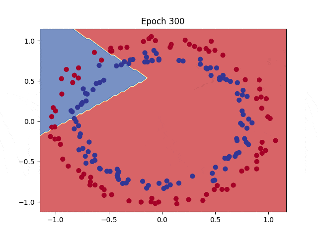
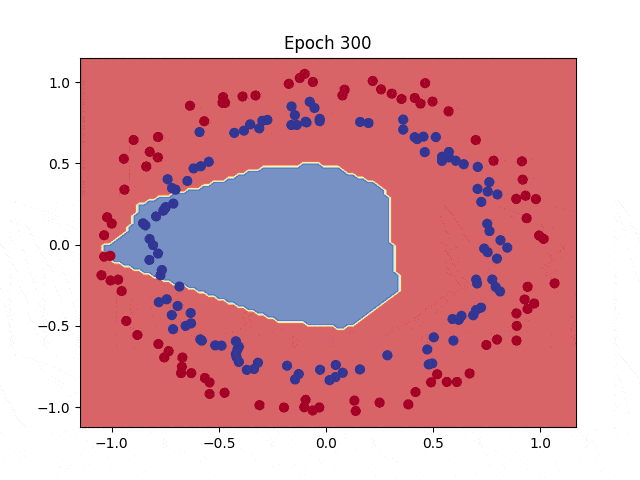

# Binary Classification with PyTorch

Binary classification is the type of classification problem having 2 possible categories to predict. In order to make an example of this problem a toy dataset is used from Scikit Learn.

# Table of Contents

- [Binary Classification with PyTorch](#binary-classification-with-pytorch)
- [Dataset](#dataset)
  - [Visualizing Data](#visualizing-data)
  - [Splitting the Data for Train and Test](#splitting-the-data-for-train-and-test)
  - [From Numpy Array to Tensors](#from-numpy-array-to-tensors)
- [Creating Model](#creating-model)
  - [Alternative Model Creation](#alternative-model-creation)
- [Loss Function](#loss-function)
  - [Choosing the RIGHT Loss Function](#choosing-the-right-loss-function)
- [Optimizer](#optimizer)
- [Metric for Model Performance: Accuracy](#metric-for-model-performance-accuracy)
- [Training](#training)
- [Time to Add Non-Linearity](#time-to-add-non-linearity)
- [Creating a Non-Linear Model](#creating-a-non-linear-model)
- [Training a Bigger Model](#training-a-bigger-model)

## Dataset

Circles dataset is a toy dataset from sklearn.datasets to visualize classification and clustering. [Source](https://scikit-learn.org/stable/modules/generated/sklearn.datasets.make_circles.html)

Generated 1000 points in cartesian coordinate system with some amount of deviation and used as dataset.

X contains the coordinates in both axis and y contains the labels.

```python
from sklearn.datasets import make_circles

X, y = make_circles(n_samples=1000, noise=0.04, random_state=7)

# X.shape -> (1000, 2)
# y.shape -> (1000,)
```

### Visualizing Data

As you can see circles dataset generates points across two circles one smaller than the other. Label of the points on the smaller circle is different from the bigger one.


### Splitting the Data for Train and Test

Used 80% of the data for train and 20% for the testing purposes.

```python
from sklearn.model_selection import train_test_split

X_train, X_test, y_train, y_test = train_test_split(X, y, test_size=0.2, random_state=7)

# X_train.shape -> (800, 2)
# X_test.shape -> (200, 2)
# y_train.shape -> (800, )
# y_test.shape -> (200, )
```

### From Numpy Array to Tensors

In order to use the created dataset within PyTorch we should convert it all to tensors. `torch.from_numpy()` method can be used to convert Numpy arrays to PyTorch tensors.

```python
import torch

X_train = torch.from_numpy(X_train).type(torch.float)
X_test = torch.from_numpy(X_test).type(torch.float)
y_train = torch.from_numpy(y_train).type(torch.float)
y_test = torch.from_numpy(y_test).type(torch.float)
```

## Creating Model

- The model has one input with 2 units. One for coordinate in x-axis, one for coordinate in y-axis. Aligning the shape of dataset used -> (n_samples, 2).
- Followed by one hidden layer with 8 units. Can have more or less neurons. Play around with it as you wish.
- Lastly one unit for output.

**Why one unit if we have 2 possible outputs?**

Knowing that solution to our problem can only have 2 possible outputs, if probability of an output label 0 is `p`, then probability of output label 1 can be calculated as `1 - p`. Only one output unit is enough.

_If you are coming from TensorFlow and wondering why model output has no sigmoid activation function answer is in [loss function](#loss-function) section._

```python
import torch.nn as nn

# Create model class
class BinaryClassificationModel(nn.Module):
    def __init__(self):
        super().__init__()

        self.linear_1 = nn.Linear(in_features=2, out_features=8)
        self.linear_2 = nn.Linear(in_features=8, out_features=1)

    def forward(self, x):
        # input -> linear_1 -> linear_2 -> output
        return self.linear_2(self.linear_1(x))

torch.manual_seed(7)
model0 = BinaryClassificationModel()

# model0.state_dict()
# OrderedDict([('linear_1.weight',
#               tensor([[ 0.0494, -0.4260],
#                       [ 0.2252,  0.2219],
#                       [-0.3779, -0.1060],
#                       [-0.4142,  0.1835],
#                       [-0.1905,  0.4968],
#                       [ 0.5020,  0.0720],
#                       [-0.3015, -0.4153],
#                       [-0.0777, -0.1990]])),
#              ('linear_1.bias',
#               tensor([ 0.3117, -0.6038,  0.6646, -0.5547,  0.5415, -0.1228,  0.3637,  0.2756])),
#              ('linear_2.weight',
#               tensor([[ 0.0148,  0.0659,  0.2685,  0.0909,  0.1876, -0.2735,  0.2517,  0.1217]])),
#              ('linear_2.bias', tensor([0.0896]))])
```

### Alternative Model Creation

For creation of simpler models or creating reusable blocks of layers inside models, below syntax can be used.

```python
import torch.nn as nn

model = nn.Sequential(
    nn.Linear(in_features=2, out_features=8),
    nn.Linear(in_features=8, out_features=1)
)
```

## Loss Function

For a regression model we have used `L1Loss()`, PyTorch implementation of `Mean Absolute Error`, to calculate how far our model's predictions from ground truth.

For a binary classification model, Binary Cross Entropy Loss is used to calculate the loss. For more info refer to [this article](https://towardsdatascience.com/understanding-binary-cross-entropy-log-loss-a-visual-explanation-a3ac6025181a).

### Choosing the RIGHT Loss Function

PyTorch has two usable Binary Cross Entropy Loss functions implemented with a major use case difference. `nn.BCELoss()` and `nn.BCEWithLogitsLoss()`.

In the [regression example](MODELS.md#how-to-create-a-model-in-pytorch), the model was directly outputting the calculated value because prediction was a continuous value. This layer output is also called as `logit` in Deep Learning. In PyTorch, loss functions directly work with logit outputs. Some of the loss functions have variants working with prediction labels instead of logits. This should be paid attention.

`nn.BCEWithLogitsLoss()` should be used when model output is not gone through sigmoid activation function. Plus, for numerical stability [LSE trick](https://en.wikipedia.org/wiki/LogSumExp) used preventing overflow and underflow.

`nn.BCELoss()` should be used when model is outputting prediction probabilities directly.

Since our model has no sigmoid activation on output layer and for numerical stability `nn.BCEWithLogitsLoss()` loss function used.

```python
# Loss function
loss_fn = nn.BCEWithLogitsLoss()
```

## Optimizer

Stochastic Gradient Descent is covering our needs for now and used for this example too. PyTorch has many built-in optimizers that can be used. For more info refer to the [docs](https://pytorch.org/docs/stable/optim.html#algorithms).

```python
# Optimizer
optimizer = torch.optim.SGD(params=model0.parameters(), lr=0.1)
```

## Metric for Model Performance: Accuracy

Until now loss was used to track the model generalization performance. Lower the better. Time to add another metric to track model performance: **Accuracy**.

Accuracy is the ratio of correct predictions to total predictions. Higher is better.

```python
# Calculating accuracy
# Formula: (True Positives + True Negatives) / (All Predictions) * 100

def calc_accuracy(y_true, y_pred):
    tp_tn = torch.eq(y_true, y_pred).sum().item() # .sum() returns a tensor. Get the value with .item()
    acc = (tp_tn / len(y_true)) * 100

    return acc
```

## Training

Almost identical to training of a regression model plus classification accuracy. Accuracy calculation function requires prediction labels. To get prediction labels as previously discussed in loss function choice, first output layer logits should be sent through sigmoid activation function due to problem being binary classification. This will provide us with prediction probability. After that probability will be rounded to nearest integer, 0 or 1 in this case, giving us the finally the prediction label.

```python
# Set global seed for reproducible results.
torch.manual_seed(7)
torch.cuda.manual_seed(7)

EPOCHS = 100
PAD = len(str(EPOCHS))

# Move data to corresponding device
X_train = X_train.to(device)
X_test = X_test.to(device)
y_train = y_train.to(device)
y_test = y_test.to(device)

# For collecting data about training
history_epochs = []
history_loss = []
history_acc = []
history_test_loss = []
history_test_acc = []

for epoch in range(1, EPOCHS+1):
    # set model to train mode
    model0.train()

    # Clean gradients from accumulation
    optimizer.zero_grad()

    # Forward pass
    y_logits = model0(X_train).squeeze() # [800, 1] -> [800]
    y_preds = torch.round(torch.sigmoid(y_logits))

    # Calculate loss and accuracy
    # Loss function BCEWithLogitsLoss() expects logits as input.
    loss = loss_fn(y_logits, y_train)
    acc = calc_accuracy(y_true=y_train, y_pred=y_preds)

    # Backpropagation
    loss.backward()

    # Adjust parameters
    optimizer.step()

    # Testing
    model0.eval()

    with torch.inference_mode():
        # Forward pass
        test_logits = model0(X_test).squeeze() # [200, 1] -> [200]
        test_preds = torch.round(torch.sigmoid(test_logits))

        # Calculate test loss
        test_loss = loss_fn(test_logits, y_test)
        test_acc = calc_accuracy(y_true=y_test, y_pred=test_preds)

        # Collect data
        history_epochs.append(epoch)
        history_loss.append(loss)
        history_acc.append(acc)
        history_test_loss.append(test_loss)
        history_test_acc.append(test_acc)

        if epoch % 10 == 0:
            print(f"Epoch {epoch:>{PAD}} | Train Loss: {loss:.5f} | Train Acc: {acc:.2f} | Test Loss: {test_loss:.5f} | Test Acc: {test_acc:.2f}")
```

**Output:**

```
Epoch  10 | Train Loss: 0.70567 | Train Acc: 53.25 | Test Loss: 0.69068 | Test Acc: 52.50
Epoch  20 | Train Loss: 0.69818 | Train Acc: 50.00 | Test Loss: 0.69410 | Test Acc: 52.00
Epoch  30 | Train Loss: 0.69610 | Train Acc: 49.75 | Test Loss: 0.69696 | Test Acc: 52.00
Epoch  40 | Train Loss: 0.69529 | Train Acc: 48.75 | Test Loss: 0.69847 | Test Acc: 49.50
Epoch  50 | Train Loss: 0.69483 | Train Acc: 48.38 | Test Loss: 0.69912 | Test Acc: 48.00
Epoch  60 | Train Loss: 0.69449 | Train Acc: 48.88 | Test Loss: 0.69932 | Test Acc: 47.00
Epoch  70 | Train Loss: 0.69421 | Train Acc: 48.62 | Test Loss: 0.69932 | Test Acc: 44.00
Epoch  80 | Train Loss: 0.69399 | Train Acc: 48.12 | Test Loss: 0.69923 | Test Acc: 44.00
Epoch  90 | Train Loss: 0.69379 | Train Acc: 48.12 | Test Loss: 0.69911 | Test Acc: 45.00
Epoch 100 | Train Loss: 0.69363 | Train Acc: 47.75 | Test Loss: 0.69898 | Test Acc: 45.00
```

But model is not learning...

There can be multiple reasons for model to not learn:

1. Small dataset
2. Small model, big dataset
3. Big model, small dataset
4. Wrong loss function
5. Wrong optimizer
6. Low train time

What can be done to improve accuracy:

1. Feed more data to model.
2. Experiment with model/data size.
3. Check if correct loss function used.
4. Change optimizer hyperparameters.
5. Train for more epochs.

More importantly, do not forget to check expected and received model outputs. Check how model decides.


Decision boundary for trained model:


If we check the visualized predictions, we can see that model is deciding according to a single line. It is linear. Can only label for over or under the line. What we need is a model that can have curved decision boundaries. Changing any of the hyperparameters without changing the model itself will not make any difference.

## Time to Add Non-Linearity

Current model can only decide according to the formula `y = mX + c` which corresponds to a straight line. No matter how many lines you put, without bending it you can not fit it into a curved data. (This might spark the debate of Linear vs. Polynomial Regression problem where Polynomial Regression causes overfitting to data but this is not about it. Besides, you should be choosing a model that can better represent your data either way.)

An activation function decides if a neuron should activate or not. In the regression model there was an activation function even if not explicitly specified. It is called linear or identity activation function which can be expressed as `y = x`. Multiplying the neuron output with 1 changes nothing hence output is still linear.

In order to bring non-linearity to a model, linear layers should be sent through a non-linear activation function like [Sigmoid](https://paperswithcode.com/method/sigmoid-activation), [Tanh](https://paperswithcode.com/method/tanh-activation) or [ReLU](https://paperswithcode.com/method/relu).

**ReLU Activation Function:**
ReLu is a simple and fast activation function. If a neuron output is negative outputs zero and if output is bigger than zero output is sent directly. Essentially `f(x) = max(0, x)`.


## Creating a Non-Linear Model

Same model, same training loop besides epoch count. But we can observe that model is learning.

```python
class CircularModel(nn.Module):
    def __init__(self):
        super().__init__()

        self.linear_1 = nn.Linear(in_features=2, out_features=8)
        self.linear_2 = nn.Linear(in_features=8, out_features=1)

        self.relu = nn.ReLU()

    def forward(self, x):
        # !!! Do not activate last layer with relu. !!!
        return self.linear_2(self.relu(self.linear_1(x)))
```

```
Epoch  300 | Train Loss: 0.68822 | Train Acc: 51.00 | Test Loss: 0.69542 | Test Acc: 45.00
Epoch  600 | Train Loss: 0.68338 | Train Acc: 51.75 | Test Loss: 0.69145 | Test Acc: 49.00
Epoch  900 | Train Loss: 0.67359 | Train Acc: 58.63 | Test Loss: 0.68319 | Test Acc: 56.00
Epoch 1200 | Train Loss: 0.65393 | Train Acc: 71.50 | Test Loss: 0.66462 | Test Acc: 65.00
Epoch 1500 | Train Loss: 0.61852 | Train Acc: 78.62 | Test Loss: 0.62897 | Test Acc: 75.00
Epoch 1800 | Train Loss: 0.56715 | Train Acc: 85.62 | Test Loss: 0.57608 | Test Acc: 85.50
Epoch 2100 | Train Loss: 0.49901 | Train Acc: 89.00 | Test Loss: 0.50507 | Test Acc: 89.00
Epoch 2400 | Train Loss: 0.42179 | Train Acc: 92.75 | Test Loss: 0.42530 | Test Acc: 92.50
Epoch 2700 | Train Loss: 0.34780 | Train Acc: 94.88 | Test Loss: 0.35132 | Test Acc: 94.50
Epoch 3000 | Train Loss: 0.28602 | Train Acc: 96.38 | Test Loss: 0.29073 | Test Acc: 95.00
```

With a denser model, decision boundaries can be made better and that can help better generalization and accuracy.



## Training a Bigger Model

Accuracy has went up to 99.5 from 95%. Plus the model generalized the data faster.

```python
class CircularModel(nn.Module):
    def __init__(self):
        super().__init__()

        self.linear_1 = nn.Linear(in_features=2, out_features=16)
        self.linear_2 = nn.Linear(in_features=16, out_features=16)
        self.linear_3 = nn.Linear(in_features=16, out_features=1)

        self.relu = nn.ReLU()

    def forward(self, x):
        # !!! Do not activate last layer with relu. !!!
        return self.linear_3(self.relu(self.linear_2(self.relu(self.linear_1(x)))))
```

```
Epoch  300 | Train Loss: 0.68368 | Train Acc: 54.87 | Test Loss: 0.68906 | Test Acc: 49.50
Epoch  600 | Train Loss: 0.66073 | Train Acc: 62.12 | Test Loss: 0.66628 | Test Acc: 61.50
Epoch  900 | Train Loss: 0.55034 | Train Acc: 94.88 | Test Loss: 0.55596 | Test Acc: 95.00
Epoch 1200 | Train Loss: 0.22765 | Train Acc: 98.88 | Test Loss: 0.21851 | Test Acc: 98.50
Epoch 1500 | Train Loss: 0.08333 | Train Acc: 98.88 | Test Loss: 0.07696 | Test Acc: 99.50
Epoch 1800 | Train Loss: 0.04943 | Train Acc: 99.38 | Test Loss: 0.04462 | Test Acc: 99.50
Epoch 2100 | Train Loss: 0.03649 | Train Acc: 99.50 | Test Loss: 0.03185 | Test Acc: 99.50
Epoch 2400 | Train Loss: 0.02981 | Train Acc: 99.50 | Test Loss: 0.02554 | Test Acc: 99.50
Epoch 2700 | Train Loss: 0.02566 | Train Acc: 99.50 | Test Loss: 0.02174 | Test Acc: 99.50
Epoch 3000 | Train Loss: 0.02287 | Train Acc: 99.50 | Test Loss: 0.01928 | Test Acc: 99.50
```


