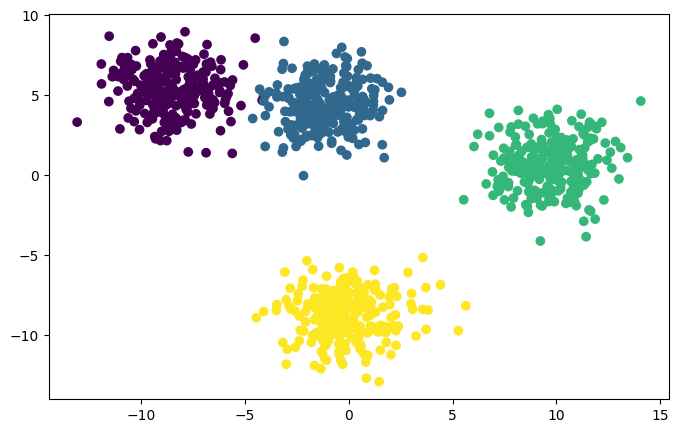
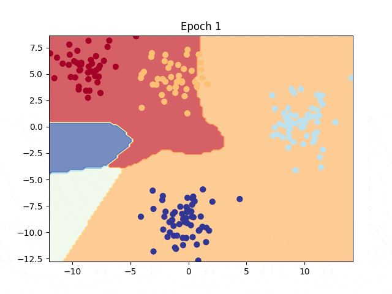

# Multiclass Classification with PyTorch

Multiclass classification is the type of classification problem having more than 2 possible categories to predict. In order to make an example of this problem a toy dataset is used from Scikit Learn.

**Key Differences from Binary Classification:**

- n classes instead of 2.
- Logits should be sent through softmax activation function instead of sigmoid.
- Due to softmax function generating probabilities for each class, index of highest probability needed for label.

**Check out [Notebook](classification.multiclass.ipynb)**.

# Table of Contents

- [Dataset](#dataset)
  - [Numpy to Tensor with Type Conversion](#numpy-to-tensor-with-type-conversion)
  - [Train Test Split](#train-test-split)
  - [Visualizing Data](#visualizing-data)
- [Creating Model](#creating-model)
- [Loss Function](#loss-function)
- [Optimizer](#optimizer)
- [Metric for Model Performance: Accuracy](#metric-for-model-performance-accuracy)
- [Training](#training)
  - [Visualize the Training Results](#visualize-the-training-results)

## Dataset

Blobs dataset used (generated) using sklearn.datasets library. For more info refer to the [docs](https://scikit-learn.org/stable/modules/generated/sklearn.datasets.make_blobs.html).

Generated 1000 samples of data, belonging to 4 individual classes with 2 input variables for coordinates in x and y axes.

```python
from sklearn.dataset import make_blobs

NUM_CLASSES = 4     # Total class number
NUM_FEATURES = 2    # coordinates in x, y axis
SEED = 7            # For reproducibility

X, y = make_blobs(n_samples=1000,
                  n_features=NUM_FEATURES,
                  centers=NUM_CLASSES,
                  cluster_std=1.5,
                  random_state=SEED)
```

### Numpy to Tensor with Type Conversion

Then converted to types required by PyTorch. More on that in [loss function]().

```python
import torch

X = torch.from_numpy(X).type(torch.float)
y = torch.from_numpy(y).type(torch.long)
```

### Train Test Split

After all the generation and correction, train and test splits were made.

- 80% train, 20% test set

```python
X_train, X_test, y_train, y_test = train_test_split(X, y, test_size=0.2, random_state=SEED)

# X_train.shape -> torch.Size([800, 2])
# X_test.shape  -> torch.Size([200, 2])
# y_train.shape -> torch.Size([800])
# y_test.shape  -> torch.Size([200])
```

### Visualizing Data

From the plot, we can clearly see that there are 4 different point clusters, each representing a different class.



## Creating Model

In [model creation of binary classification section](CLASSIFICATION.BINARY.md#alternative-model-creation), we have seen there is an alternative way to create models. The Sequential stack seen in constructor is an example usage of that. Layers and activation functions can be placed on top of each other. This is useful for simpler architectures or creating reusable neural network blocks. Also notice that `forward()` method no longer requires sending layer outputs to activation functions manually. All handled by Sequential stack.

```python
import torch.nn as nn

class BlobClassifier(nn.Module):
    def __init__(self, in_features, out_features, units):
        super().__init__()

        self.linear_stack = nn.Sequential(
            nn.Linear(in_features=in_features, out_features=units),
            nn.ReLU(),
            nn.Linear(in_features=units, out_features=units),
            nn.ReLU(),
            nn.Linear(in_features=units, out_features=out_features)
        )

    def forward(self, x):
        return self.linear_stack(x)
```

PyTorch is fully Python compatible, meaning all Python features can be seamlessly integrated with PyTorch. Using this property, model class is parameterized and made it available to generate different parameterized models with same code piece utilizing OOP principles.

The model has 2 inputs for coordinates in x and y axes. Two hidden layers with 8 neurons each and an output layer of 4 neurons for outputting probabilities (logits actually) for each class in dataset.

```python
model = BlobClassifier(NUM_FEATURES, NUM_CLASSES, 8)
```

```
BlobClassifier(
  (linear_stack): Sequential(
    (0): Linear(in_features=2, out_features=8, bias=True)
    (1): ReLU()
    (2): Linear(in_features=8, out_features=8, bias=True)
    (3): ReLU()
    (4): Linear(in_features=8, out_features=4, bias=True)
  )
)
```

## Loss Function

For classification, Cross Entropy loss is probably the most used loss function. In binary classification we have used built-in Binary Cross Entropy loss function from PyTorch. For multiclass purposes again Cross Entropy loss is used but a version that can handle n class scenarios.

```
loss_fn = nn.CrossEntropyLoss()
```

`nn.CrossEntropyLoss()` expects integer labels. If your data label type is float, you will be greeted an error like `RuntimeError: "nll_loss_forward_reduce_cuda_kernel_2d_index" not implemented for 'Float'`. Notice that in the [docs](https://pytorch.org/docs/stable/generated/torch.nn.CrossEntropyLoss.html#torch.nn.CrossEntropyLoss) target is dtype of `torch.long`.

## Optimizer

Again Stochastic Gradient Descent used with learning rate of `0.1`.

```python
optimizer = torch.optim.SGD(model.parameters(), lr=0.1)
```

## Metric for Model Performance: Accuracy

Until now loss was used to track the model generalization performance. Lower the better. Time to add another metric to track model performance: **Accuracy**.

Accuracy is the ratio of correct predictions to total predictions. Higher is better.

```python
# Calculating accuracy
# Formula: (True Positives + True Negatives) / (All Predictions) * 100

def calc_accuracy(y_true, y_pred):
    tp_tn = torch.eq(y_true, y_pred).sum().item() # .sum() returns a tensor. Get the value with .item()
    acc = (tp_tn / len(y_true)) * 100

    return acc
```

## Training

Training is almost identical to binary classification training loop.

- Set global seeds for reproducibility. One for CPU one for GPU just in case.
- Be sure that data and the model in the same device. Work in GPU if machine has a GPU, else work in memory.
- Set model to train mode.
- Clear accumulated gradients in buffers.
- Make predictions with train set and get logits from model.
- For calculating train accuracy get labels by `logits -> softmax -> argmax -> labels` (Optional).
- Calculate the loss.
- Calculate the accuracy (Optional).
- Backpropagate.
- Adjust model parameters

**Optional Test/Validation Loop**

- Set model to evaluation mode.
- Make predictions with test set.
- For calculating test accuracy get labels by `logits -> softmax -> argmax -> labels`.
- Calculate the test loss.
- Calculate the test accuracy.
- Print out the results. (Not mandatory but also should not be optional.)

```python
torch.manual_seed(7)
torch.cuda.manual_seed(7)

EPOCHS = 100
PAD = len(str(EPOCHS))


# Be sure that model and data in same device
model.to(device)
X_train = X_train.to(device)
X_test = X_test.to(device)
y_train = y_train.to(device)
y_test = y_test.to(device)

# Train loop
for epoch in range(1, EPOCHS+1):
    # Set model to train mode
    model.train()

    # Stop gradients accumulating
    optimizer.zero_grad()

    # Make predictions
    y_logits = model(X_train)
    y_preds = torch.softmax(y_logits, dim=1).argmax(dim=1)

    # Calculate loss
    loss = loss_fn(y_logits, y_train)

    # Calculate accuracy
    acc = calc_accuracy(y_train, y_preds)

    # Backpropagation
    loss.backward()

    # Adjust parameters
    optimizer.step()


    # Test loop
    # Set model to evaluation mode
    model.eval()

    with torch.inference_mode():
        # Make test predictions
        test_logits = model(X_test)
        test_preds = torch.softmax(test_logits, dim=1).argmax(dim=1)

        # Calculate test loss
        test_loss = loss_fn(test_logits, y_test)

        # Calculate test accuracy
        test_acc = calc_accuracy(y_test, test_preds)

        if epoch % 10 == 0:
            print(f"Epoch {epoch:>{PAD}} | Loss: {loss:.5f} | Acc: {acc:.2f} | Test Loss: {test_loss:.5f} | Test Acc: {test_acc:.2f}")
```

```
Epoch  10 | Loss: 0.77344 | Acc: 62.25 | Test Loss: 0.73814 | Test Acc: 62.50
Epoch  20 | Loss: 0.49740 | Acc: 73.00 | Test Loss: 0.48031 | Test Acc: 69.00
Epoch  30 | Loss: 0.26639 | Acc: 97.88 | Test Loss: 0.23555 | Test Acc: 98.00
Epoch  40 | Loss: 0.14336 | Acc: 98.12 | Test Loss: 0.12407 | Test Acc: 98.50
Epoch  50 | Loss: 0.10065 | Acc: 98.50 | Test Loss: 0.08993 | Test Acc: 98.50
Epoch  60 | Loss: 0.07968 | Acc: 98.75 | Test Loss: 0.07472 | Test Acc: 99.00
Epoch  70 | Loss: 0.06737 | Acc: 98.62 | Test Loss: 0.06658 | Test Acc: 99.00
Epoch  80 | Loss: 0.05931 | Acc: 98.88 | Test Loss: 0.06172 | Test Acc: 99.00
Epoch  90 | Loss: 0.05360 | Acc: 98.88 | Test Loss: 0.05856 | Test Acc: 99.00
Epoch 100 | Loss: 0.04933 | Acc: 98.88 | Test Loss: 0.05636 | Test Acc: 99.00
```

### Visualize the Training Results

Trained model is predicting really well. Additional steps can be made but 99% is pretty good. Also data is almost linearly separable. Non-linearity can be removed if wanted. But it would not hurt to have it in the model. Model would be much more resilient to input data if dataset is not contains linearly separable data.


