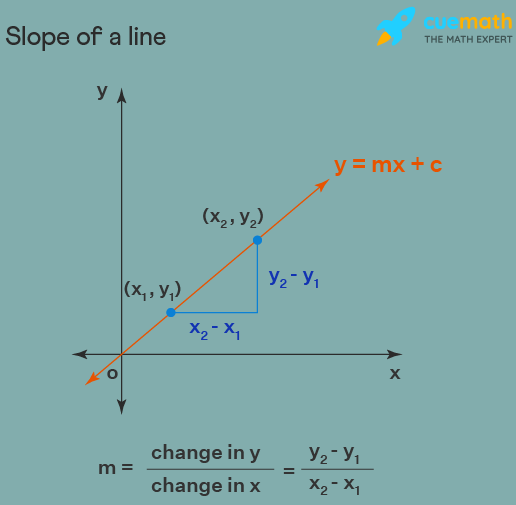
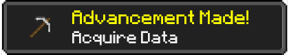
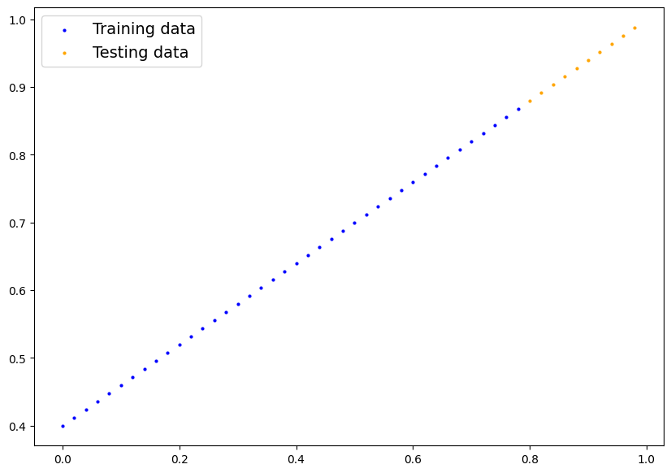
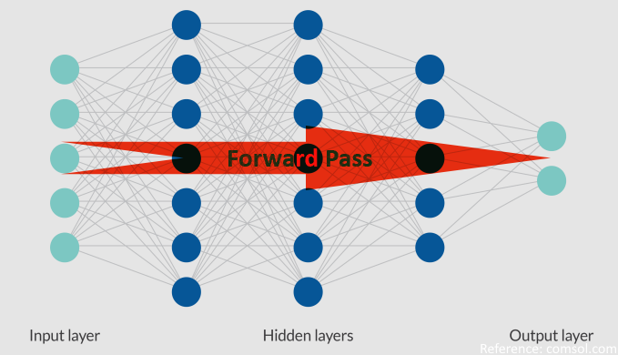
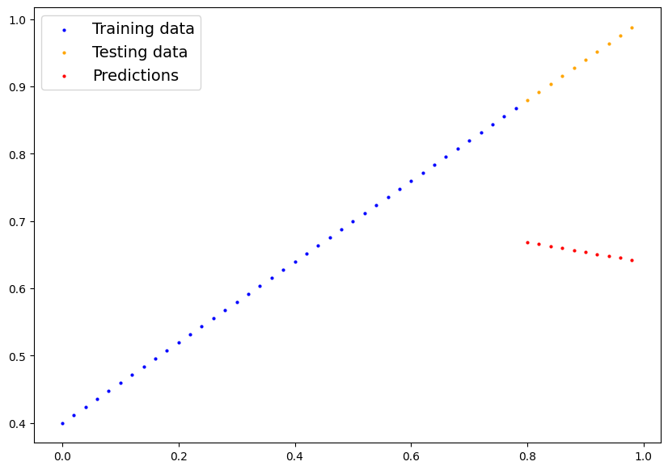
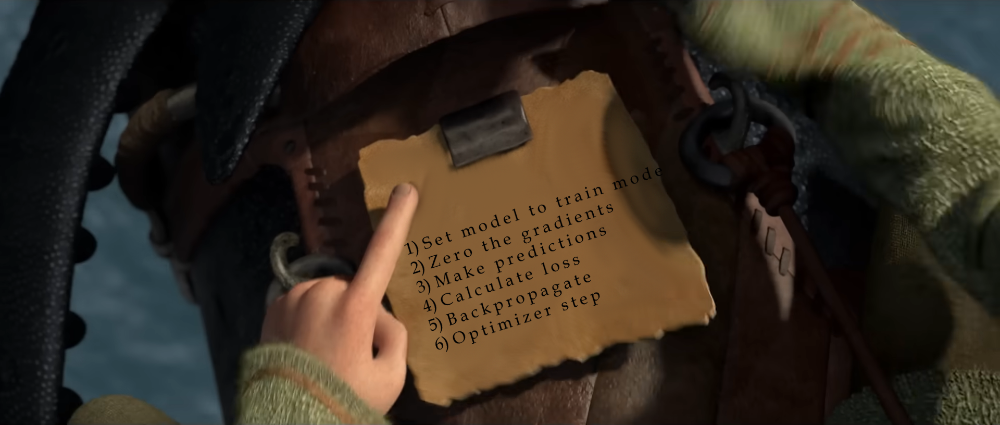
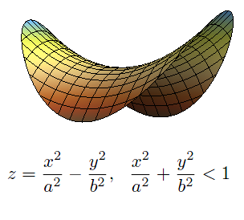
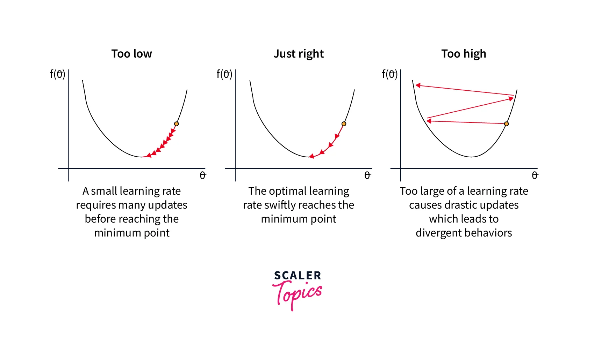
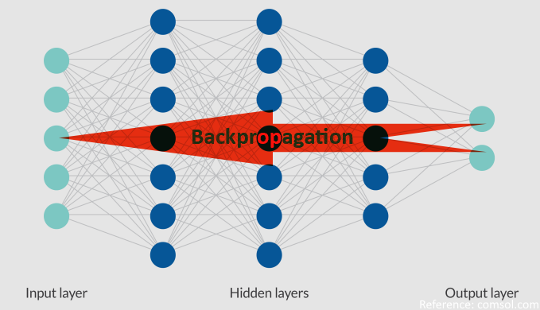
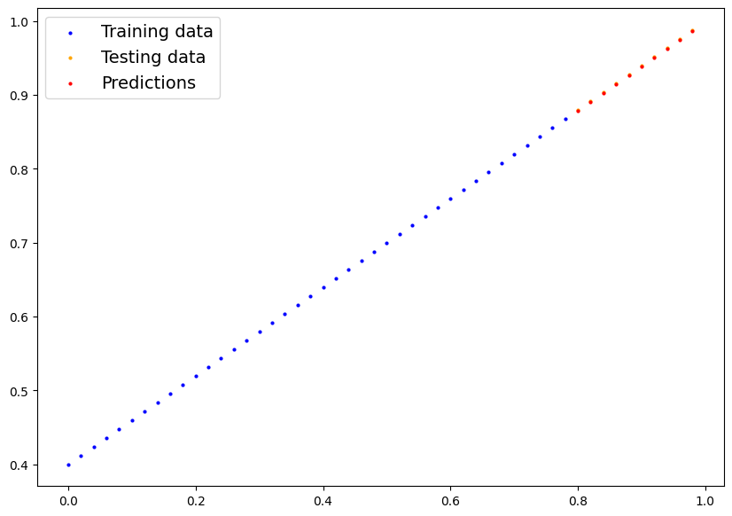

# Basic Model Operations on PyTorch

**Check out [Notebook](models.ipynb)**.

# Table of Contents

- [What is a model?](#what-is-a-model)
- [How to Create a Model?](#how-to-create-a-model)
  - [Model Creation Preparation 1: Acquire Data](#model-creation-preparation-1-acquire-data)
  - [Model Creation Preparation 2: Train Test Split](#model-creation-preparation-2-train-test-split)
- [How to Create a Model, in PyTorch?](#how-to-create-a-model-in-pytorch)
  - [What is Forward Pass?](#what-is-forward-pass)
  - [Model Structure of Proposed Solution](#model-structure-of-proposed-solution)
  - [Creating a New Instance of a Model](#creating-a-new-instance-of-a-model)
  - [Checking Out Model Parameters](#checking-out-model-parameters)
- [How to Use the Created Model?](#how-to-use-the-created-model)
- [How to Train Your Model?](#how-to-train-your-model)
  - [What is Model Training?](#what-is-model-training)
  - [What is Gradient (Descent)?](#what-is-gradient-descent)
  - [What is Loss Function?](#what-is-loss-function)
  - [What is an Optimizer?](#what-is-an-optimizer)
  - [What is Backpropagation?](#what-is-backpropagation)
  - [Train Loop](#train-loop)
  - [Enhancing Train Loop](#enhancing-train-loop)
  - [Observing Training Results](#observing-training-results)
- [Saving and Loading Models](#saving-and-loading-models)
  - [Save Model](#save-model)
  - [Load Model](#load-model)
- [Combining What We Have Learned](#combining-what-we-have-learned)
  - [Device Independent Processing](#device-independent-processing)
  - [Re-writing Linear Regression Model PyTorch Way](#re-writing-linear-regression-model-pytorch-way)
  - [Create New Instance of the Model](#create-new-instance-of-the-model)
  - [Move Model to GPU](#move-model-to-gpu)
  - [Train with GPU](#train-with-gpu)
  - [Results](#results)

## What is a model?

In real world, _generally_ if there is a problem, there is also a solution exists. To achieve this solution, mathematical models are created.

**Problem:** What is the slope of the line inside a cartesian coordinate system and how to represent the line formulaically?

**Solution:** Difference in y coordinates divided by difference in x coordinates gives the slope of a line. The line can have a slope that can be represented as `tanθ`. Theta (θ) is the angle between the x axis and the line. A line can also be displaced for an amount, enabling it to move inside coordinate system.

- This line fitting problem is also called **Linear Regression**



- This is what modelling mathematically is. Creating a solution for the problem in a problem space.
- But not all problems can be modelled easily like the slope problem.
- That is when we start to use approximation instead of true answer.
- Approximation has a margin of error unlike solving the modelled equation.
- My professor from college told us once: **"Model it mathematically if you can. That means there is an easier solution for the problem. But if problem is too complex to model mathematically, approximate to the real solution."**
- That is when we use predictive models. That is what underlies today's Machine Learning and Deep Learning methodologies. We approximate and predict.

## How to Create a Model?

- If problem is specific, like finding the slope of points in coordinate system, there should also be a pattern that can be observed. Another example, classifying cats and dogs. As much as both animals have similar properties like having 4 legs, fur and eyes; there are also discriminative properties like fur pattern, whiskers and ear shape. A little bit more complex to model than a simple line but still an existing problem that can be solved.
- If your problem has not have a discriminative pattern, try to reduce your problem to smaller problems that you can start picking up patterns by yourself.

**Note:** Or don't if you want to see correlation between values, categories etc. for academic purposes or such like Exploratory Data Analysis. But there is a strong chance that if there is no pattern to be learned, your model's performance will be as good as guessing randomly.

### Model Creation Preparation 1: Acquire Data

- ML/DL models start with random values and according to some data, those random values adjusted with the values better representing given data.
- So according to that logic first things first we need some data.
- Normally this data would be cleaned by someone and has a pattern that can be learned by ML/DL model.

**Problem:** Find the line that represents given data.

**Solution:** Implement slope function to find suiting.

**Let's create some synthetic data that we can control inputs and outputs by some rule and watch our model learn how to represent it.**

**Expected Output:** Model parameters having close values to ground truth (our synthetic data).

`Linear Regression => f(x) = y = mx + c`

- According to above formula we will generate tensors. But what is what?

**x** is the value in x axis. In this case **X** will be our inputs and will be written as capital by convention as it represents a matrix (a column vector in this case).

**m** is the slope with the x axis. Gives ability to move between 0-90 degrees in the first quadrant of the cartesian coordinate system. This way we can find the line having minimum distance to all points in the data. It is also known as **weight**.

**c** is a constant value. Enables movement in y axis. This value is also known as **bias**.

**y** will be our output/label/prediction feature.



<div style="clear: both"></div>

```python
import torch

# Can be any arbitrary number.
weight = 0.6
bias = 0.4

# Generate data - X -> features, y -> labels
X = torch.arange(0, 1, 0.02).unsqueeze(dim=1) # add one dimension to turn into column vector.
y = weight * X + bias

X[:5], X.shape, y[:5], y.shape

# First 5 elements of input:
# (tensor([[0.0000],
#          [0.0200],
#          [0.0400],
#          [0.0600],
#          [0.0800]]),

# Size of the input:
# torch.Size([50, 1]),

# First 5 elements of the labels:
# tensor([[0.4000],
#         [0.4120],
#         [0.4240],
#         [0.4360],
#         [0.4480]]),

# Size of the labels:
# torch.Size([50, 1]))
```

### Model Creation Preparation 2: Train Test Split

- I've used 80% of total data as train sample and 20% as test data.

```python
train_size = 0.8 # We are aiming for 80% train and 20% test data.
train_test_split = int(len(X) * train_size)

X_train, y_train = X[:train_test_split], y[:train_test_split]
X_test, y_test = X[train_test_split:], y[train_test_split:]

len(X_train), len(y_train), len(X_test), len(y_test)

# outputs:
# (40, 40, 10, 10)
```

- As we can see data created is a nice line. Inputs between 0 and 1. Due to bias, all labels started from 0.4.



## How to Create a Model, in PyTorch?

There are 3 main steps to create a model in PyTorch:

1. Subclass `torch.nn.Module`.
2. Set parameters individually or use available layers in constructor.
3. Override `forward()` method fo define what will happen in the forward pass.

### What is Forward Pass?



For the feedforward neural networks, data flows from input to output. In this process, data is transformed and an output is generated with the help of weights and biasses. Also known as forward propagation.

All `torch.nn.Module` subclasses have to implement the `forward()` function in order to apply transformations to input data.

### Model Structure of Proposed Solution

- All model parameters initialized with random values. This is the start of fitting model to our data.
- Model weight and bias will gradually approach to our synthetic ground truth weight and bias values in order to better represent the data.
- With `nn.Parameter()` class a model parameter can be defined. Has two important parameters within to fill.
  1. data: Initial tensor.
  2. requires_grad: Does tensor require gradient. Used to track gradients for backpropagation.

```python
class LinearRegressionModel(nn.Module):
    def __init__(self):
        super().__init__()

        # Data has one weight and one bias so one tensor for each is needed.
        self.weight = nn.Parameter(data=torch.randn(1, dtype=torch.float),
                                    requires_grad=True)

        self.bias = nn.Parameter(data=torch.randn(1, dtype=torch.float),
                                    requires_grad=True)

    # Function for the forward pass.
    # "x" marks the input.
    def forward(self, x:torch.Tensor) -> torch.Tensor:
        return self.weight * x + self.bias
```

### Creating a New Instance of a Model

After model class is written, a model can be instantiated same as a python class

```python
# For getting same tensors every time.
torch.manual_seed(7)
linear_model = LinearRegressionModel()
```

### Checking Out Model Parameters

The proposed model currently has only 2 parameters namely weight and bias. There are 2 ways of getting details about all the parameters:

1. `model.parameters()` will return a generator object.

   ```python
   list(linear_model.parameters())

   # Outputs:
   # [Parameter containing:
   #  tensor([-0.1468], requires_grad=True),
   #  Parameter containing:
   #  tensor([0.7861], requires_grad=True)]
   ```

2. `model.state_dict()` will return an ordered dictionary containing parameters with their names.

   ```python
   linear_model.state_dict()

   # Outputs
   # OrderedDict([('weight', tensor([-0.1468])), ('bias', tensor([0.7861]))])
   ```

## How to Use the Created Model?

- Inputting data to model and getting an output from a model means making a prediction.
- A model can make predictions without being trained. Because there are parameters initialized already when model itself is initialized.
- Training only makes model more accurate of generating the correct or expected output.
- Simply use the model instance like a method.
- `forward()` method that we implemented will be called when a model generating output in PyTorch.

```python
y_preds = linear_model(X_test)

# y_preds:
# tensor([[0.6687],
#         [0.6658],
#         [0.6628],
#         [0.6599],
#         [0.6570],
#         [0.6540],
#         [0.6511],
#         [0.6482],
#         [0.6452],
#         [0.6423]], grad_fn=<AddBackward0>)
```

- Making predictions is also called "running inference".
- Using `with torch.inference_mode()` then getting the output is the recommended way of running inferences in PyTorch due to layers working differently in train and test times. [Docs](https://pytorch.org/docs/stable/generated/torch.autograd.grad_mode.inference_mode.html).
- Inference mode stops PyTorch from tracking gradients. While tracking gradients, all movements and changes of tensors will be watched by PyTorch hence much more system resources will be used.
- Gradient tracking is useful in train time because of another part in machine learning called **backpropagation** that will be discussed later.
- For test time, it is not useful. There will be no changes in tensors so tracking will only slow our model's prediction time.

```python
with torch.inference_mode():
   y_preds = linear_model(X_test)

# y_preds:
# tensor([[0.6687],
#         [0.6658],
#         [0.6628],
#         [0.6599],
#         [0.6570],
#         [0.6540],
#         [0.6511],
#         [0.6482],
#         [0.6452],
#         [0.6423]], grad_fn=<AddBackward0>)
```

- You can see that predictions are quite off from our predefined ground truth values.
- This is the effect of wrong parameter values.
- In simple words, wrong weight and bias causing calculation to fail.



- Let's fix that.

## How to Train Your Model?



### What is Model Training?

- We have **started** with the **random values** as weight and bias.
- We have **seen** that model is not predicting correctly.
- We have **seen** that random start values is the best option to **start generating a solution**.
- But random values are not the correct values. We need to **get as close to our ground truth** values.
- We need our model to be able to **represent** the pattern in our data correctly.

**Disclaimer:** Ground truth (end goal/synthetic data) is set due to learning and visualizing purposes. In real world scenarios pattern in data might not be visible to us easily. _That is why we conduct Exploratory Data Analysis on our data before jumping directly into machine learning. But this is out of the scope._

- For machine to learn there are some steps:
  1. Start from somewhere: **Gradient Descent**
  2. See how wrong you are: **Loss Function**
  3. Step away from mistake: **Backpropagation**
  4. Mentor for descending: **Optimizer**

### What is Gradient (Descent)?



_You have seen so many Medium articles at this point I will not use that gradient image. Enjoy the gradient of a pringle._

Gradient descent is the key of machine learning algorithms. Thinking about a hill is overused but the best way to understand it. At the hill top potential is at the maximum. Hence can be named as **global maximum**. At the ground level potential is at it's minimum. So it can be called as **global minimum**.

A machine learning algorithm's purpose is to reach the global minimum. Potential is none so no entropy. Basically ideal and prediction result is the same as solving the mathematical model of the problem.

Gradient descent algorithm basically achieves this purpose. There is a gradient (a wiggly surface) and model descents through to reach the ground level.

Key steps are:

1. Start from any point on in gradient.
   - That is why initial parameters are random. Because knowing the whereabouts of global minimum is near impossible. Starting from anywhere has the same probability of reaching to solution. _I think._
2. Calculate the slope.
   - Using a **loss function** calculate how far the model's predictions from ground truth.
3. Move opposite of the slope
   - Go down hill.
4. Repeat until error/loss minimized.

### What is Loss Function?

- A loss function calculates how far model's predictions from test values (ground truth).
- There are many loss functions created in time for many machine learning problems like regression, classification, clustering etc.
- Our problem is a regression problem.
- We have seen that predictions of our model is way far from what it should be.
- Ideally they need to align be on top of each other.
- For a regression problem couple loss functions can be used like getting the average of distance for all the points and move them up a bit or get the square of the error...
- They all have different benefits. Which one to use is up to you. Learn them then try and see which one yields better results.
- [Docs: Loss Function](https://pytorch.org/docs/stable/nn.html#loss-functions)
- [Cool Video about loss functions.](https://youtu.be/v_ueBW_5dLg?feature=shared)

- For minimizing the distance between points we will use **L1Loss** from built-in PyTorch loss functions. It calculates the mean average error for calculation between train and test values. Just like we need.

```python
import torch.nn as nn

# setup a loss function
loss_fn = nn.L1Loss()
```

### What is an Optimizer?

- [The loss function is the guide to the terrain, telling the optimizer when it’s moving in the right or wrong direction.](https://ml-cheatsheet.readthedocs.io/en/latest/optimizers.html)
- Terrain is the gradient, loss is your compass and optimizer is your model's legs in this scenario.
- That is why choosing the correct loss function plays a crucial role. Wrong directions lead to stray from the path.
- Choosing the optimizer is not a difficult task but requires a bit of knowledge among with some trial and error.
- PyTorch has optimizers built-in.
- [Docs: Optimizers](https://pytorch.org/docs/stable/optim.html)

**A very important hyperparameter, Learning Rate:** Optimizer will adjust the model parameters but in respect to what? Apples? Bananas? No, making adjustments simply is not done in one go.

- Instead, the ideal parameters are approached step by step.
- Learning rate is the magnitude of that step.
- Too low, model learns so slowly or model gets stuck on local minimums easily.
- Too high, model overshoots and misses the plateau.
- Can be picked with trial and error. Generally, start with default values then alter if needed.



Setting an optimizer in PyTorch:

```python
# setup an optimizer
# SGD - Stochastic Gradient Descent. Literally the thing we want to achieve. The gradient descent.
optimizer = torch.optim.SGD(params=linear_model.parameters(),
                            lr=0.01)

# optimizer:
# SGD (
# Parameter Group 0
#     dampening: 0
#     differentiable: False
#     foreach: None
#     fused: None
#     lr: 0.01
#     maximize: False
#     momentum: 0
#     nesterov: False
#     weight_decay: 0
# )
```

### What is Backpropagation?



- In the forward pass, data has went from input to output. But at the start model guessed wrong. That means we need to adjust our parameters.
- In the backward pass, or backpropagation, error is propagated from output to input, hence the name.
- Which parameters caused to decision of wrong prediction is found here. For every parameter of every layer in a neural network can be responsible of this error.
- Purpose of backpropagation is to find the responsible parameter(s) and adjust their values.
- This calculation is done with gradients.
- That is why every tensor is tracked by PyTorch. To see all the calculations and ease the backward pass.
- Every parameter has effect on the next calculation to be done. To propagate all of them chain rule is used. This way, major or minor, error on all parameters can be addressed.

### Train Loop

Let's see how all these steps are applied with code.

**Most basic version of a training loop:**

1. Loop for a given number of times, namely epoch.
2. Set model to train mode.
   - [Train and Eval Mode Differences](https://www.geeksforgeeks.org/what-does-model-train-do-in-pytorch/)
3. Clear the gradient buffer.
   - [It is beneficial to zero out gradients when building a neural network. This is because by default, gradients are accumulated in buffers (i.e, not overwritten) whenever `.backward()` is called.](https://pytorch.org/tutorials/recipes/recipes/zeroing_out_gradients.html)
4. Make predictions with current weights of model.
5. Calculate loss with predictions against ground truth.
6. Backward pass the error.
7. Adjust model parameters using optimizer.

```python
torch.manual_seed(7)
EPOCHS = 200

# 1) Loop for a specified amount
for epoch in range(EPOCHS):
    # 2) Set model to train mode
    linear_model.train()

    # 3) Clear the gradients
    optimizer.zero_grad()

    # 4) Make predictions
    y_pred = linear_model(X_train)

    # 5) Calculate the loss
    loss = loss_fn(y_pred, y_train)

    # 6) Backpropagation
    loss.backward()

    # 7) Adjust model parameters
    optimizer.step()
```

### Enhancing Train Loop

- We can do much more than just using predefined functions of PyTorch.
- Since entirety of PyTorch is fully compatible with python itself, we can customize the train loop for our needs.

- Like adding validation or collecting data about epochs.

```python
torch.manual_seed(7)
EPOCHS = 250
PAD = len(str(EPOCHS))

# Keep epochs for binning
epoch_history = []
# Keep track of losses
loss_history = []
test_loss_history = []

# 1) Loop for a specified amount
for epoch in range(1, EPOCHS+1):
    # 2) Set model to train mode
    linear_model.train()

    # 3) Clear the gradients
    optimizer.zero_grad()

    # 4) Make predictions
    y_pred = linear_model(X_train)

    # 5) Calculate the loss
    loss = loss_fn(y_pred, y_train)

    # 6) Backpropagation
    loss.backward()

    # 7) Adjust model parameters
    optimizer.step()

    # Set model to evaluation mode
    linear_model.eval()

    # Use inference mode for testing.
    with torch.inference_mode():
        test_pred = linear_model(X_test)
        test_loss = loss_fn(test_pred, y_test)

    # Can be customized. For now just print losses every epoch.
    if epoch % 25 == 0:
        epoch_history.append(epoch)
        loss_history.append(loss)
        test_loss_history.append(test_loss)

        print(f"Epoch: {epoch:>{PAD}} | Loss: {loss:.4f} | Test Loss: {test_loss:.4f}")
```

```
Outputs:
Epoch:  25 | Loss: 0.0786 | Test Loss: 0.1829
Epoch:  50 | Loss: 0.0700 | Test Loss: 0.1629
Epoch:  75 | Loss: 0.0615 | Test Loss: 0.1429
Epoch: 100 | Loss: 0.0529 | Test Loss: 0.1229
Epoch: 125 | Loss: 0.0443 | Test Loss: 0.1029
Epoch: 150 | Loss: 0.0357 | Test Loss: 0.0829
Epoch: 175 | Loss: 0.0271 | Test Loss: 0.0629
Epoch: 200 | Loss: 0.0185 | Test Loss: 0.0423
Epoch: 225 | Loss: 0.0099 | Test Loss: 0.0223
Epoch: 250 | Loss: 0.0014 | Test Loss: 0.0016
```

### Observing Training Results

We can see that model's weight and bias is really close to what we set at the beginning.

```python
linear_model.state_dict()

# Outputs:
# OrderedDict([('weight', tensor([0.5952])), ('bias', tensor([0.4026]))])
```

If you look closely ground truth and test values almost on top of each other.

This gives us the result of how a model can learn starting from total randomness and slowly but surely approaching to solution.



## Saving and Loading Models

- We have completed model training but the model still lives in computer memory.
- Upon closing the computer all our hard work will vanish.
- How to persist our model for later use? Of course saving it to the disk.
- With `torch.save()` method we can save the model and if needed can be loaded in environment with `torch.load()` method.
- Also PyTorch uses pickle library to serialize every serializable object. Saving the complete model is discouraged. Instead, save the weights of a model.
- For more info check out [Saving and Loading Models in PyTorch](https://pytorch.org/tutorials/beginner/saving_loading_models.html)
- Saving weights only is by default. But specifying loading weights requires `torch.nn.Module.load_state_dict()` to be called in `.load()` method.

- For save path, a string or a path-like object can be used or for more control over path strings `os` package can be used too.

- I have been using `os` for my path processes but for a difference (and learning purposes) `pathlib` is used in the following examples.

### Save Model

```python
from pathlib import Path

MODEL_PATH = Path("models")
# https://docs.python.org/3/library/pathlib.html#pathlib.Path.mkdir
# .mkdir(): make directory
# -parents=True: create parent files if needed.
# -exist_ok=True: Do not raise error if file exists already.
MODEL_PATH.mkdir(parents=True, exist_ok=True)

MODEL_NAME = "linear_model.pth"

# A syntax usable in pathlib denotes a path structure.
MODEL_SAVE_PATH = MODEL_PATH / MODEL_NAME

print(f"Model is saving to {MODEL_SAVE_PATH}")

# Saving the state dictionary is recommended since only parameters are saved
# and can be loaded directly to the model later.
# Saving the entire model can break the code in various ways due to
# pickle's inner working.
torch.save(obj=linear_model.state_dict(), f=MODEL_SAVE_PATH)
```

### Load Model

```python
# Load the saved weights on a new instance.
loaded_model = LinearRegressionModel()
print("Weights before loading weights: ", loaded_model.state_dict())

loaded_model.load_state_dict(torch.load(f=MODEL_SAVE_PATH, weights_only=True))
print("Weights after loading weights: ", loaded_model.state_dict())

# Outputs:
# Weights before loading weights:  OrderedDict([('weight', tensor([0.9468])), ('bias', tensor([-1.1143]))])
# Weights after loading weights:  OrderedDict([('weight', tensor([0.5952])), ('bias', tensor([0.4026]))])
```

## Combining What We Have Learned

**Note:** Check out [tensor operations](TENSORS.md) if you have not already. Be sure to check out [Tensors Notebook](tensors.ipynb) too.

### Device Independent Processing

**Note:** If you do not have a GPU or have not installed PyTorch for GPU use you can only use CPU. Check out [installing PyTorch](README.md#installing-pytorch).

```python
device = "cuda" if torch.cuda.is_available() else "cpu"

# device:
# 'cuda'
```

### Re-writing Linear Regression Model PyTorch Way

```python
class LinearRegressionModelV2(nn.Module):
    def __init__(self,):
        super().__init__()

        # https://pytorch.org/docs/stable/generated/torch.nn.Linear.html
        # Input value: X, output value: y
        self.linear_layer = nn.Linear(in_features=1,
                                      out_features=1,
                                      bias=True) # Dense layer if you are coming from TensorFlow.

    def forward(self, x:torch.Tensor) -> torch.tensor:
        return self.linear_layer(x)
```

### Create New Instance of the Model

```python
# Seed for reproducibility
torch.manual_seed(77)
linear_model_v2 = LinearRegressionModelV2()
```

### Move Model to GPU

```python
linear_model_v2.to(device)

# Verify
next(linear_model_v2.parameters()).device

# Outputs:
# device(type='cuda', index=0)
```

### Train with GPU

```python
# Choose loss function
loss_fn = nn.L1Loss()

# Choose optimizer
optimizer = torch.optim.Adam(params=linear_model_v2.parameters(),
                             lr=0.01)

# Model is in GPU but train and test data is not will throw an error.
X_train = X_train.to(device)
y_train = y_train.to(device)
X_test = X_test.to(device)
y_test = y_test.to(device)

# Collecting data
EPOCHS = 200
# A bit controversial but more than enough here
PAD = len(str(EPOCHS))

epoch_history = []
train_loss_history = []
test_loss_history = []

# train loop
torch.manual_seed(7)
for epoch in range(1, EPOCHS + 1):
    # set model to train mode
    linear_model_v2.train()

    optimizer.zero_grad()

    y_preds = linear_model_v2(X_train)

    loss = loss_fn(y_preds, y_train)
    loss.backward()

    optimizer.step()

    # Test/Validation Loop
    if epoch % 25 == 0:
        # Set model to eval mode
        linear_model_v2.eval()

        with torch.inference_mode():
            test_preds = linear_model_v2(X_test)
            test_loss = loss_fn(test_preds, y_test)

        # Collect data
        epoch_history.append(epoch)
        train_loss_history.append(loss)
        test_loss_history.append(test_loss)

        print(f"Epoch: {epoch:>{PAD}} | Train Loss: {loss:.5f} | Test Loss: {test_loss:.5f}")
```

### Results

```
Epoch:  25 | Train Loss: 0.89135 | Test Loss: 1.26053
Epoch:  50 | Train Loss: 0.54385 | Test Loss: 0.78803
Epoch:  75 | Train Loss: 0.19635 | Test Loss: 0.31553
Epoch: 100 | Train Loss: 0.03741 | Test Loss: 0.01455
Epoch: 125 | Train Loss: 0.01231 | Test Loss: 0.01302
Epoch: 150 | Train Loss: 0.00228 | Test Loss: 0.00299
Epoch: 175 | Train Loss: 0.00015 | Test Loss: 0.00090
Epoch: 200 | Train Loss: 0.00179 | Test Loss: 0.00369
```

```python
# Test
linear_model_v2.eval()

with torch.inference_mode():
    y_hat = linear_model_v2(X_test)

# Take prediction result tensor to CPU
# Matplotlib uses Numpy.
# Numpy works on CPU.
# If device not changed, an error will thrown.
# Try for yourself and see one of the most common errors you'll encounter.
# Tensors on different devices can not interact with each other.
# You must carry them to necessary device.
plot_predictions(predictions=y_hat.cpu())
```


