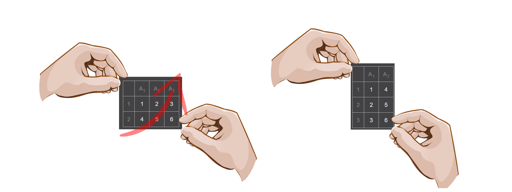
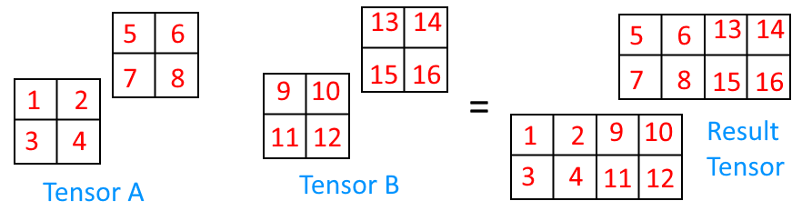

# Tensors on PyTorch

**Check out [Notebook](tensors.ipynb)**.

# Table of Contents

1.  [Creation of Tensor](#creation-of-tensor)
    1. [By Hand:](#by-hand)
    2. [With Methods](#with-methods)
       1. [Random Tensor](#random-tensor)
       2. [Tensor of Zeros](#tensor-of-zeros)
       3. [Tensor of Ones](#tensor-of-ones)
       4. [Tensor in Range](#tensor-in-range)
       5. [New Tensor from Shape of Another Tensor](#new-tensor-from-shape-of-another-tensor)
    3. [Intermediate Tensor Creation](#intermediate-tensor-creation)
       1. [Tensor Data Type](#tensor-data-type)
       2. [Tensor Device](#tensor-device)
2.  [Tensor Properties](#tensor-properties)
3.  [Tensor Manipulation](#tensor-manipulation)
    1. [Addition](#addition)
    2. [Subtraction](#subtraction)
    3. [Multiplication](#multiplication)
    4. [Division](#division)
    5. [Matrix Multiplication](#matrix-multiplication)
    6. [Matrix Transpose](#matrix-transpose)
4.  [Tensor Aggregation](#tensor-aggregation)
    1. [Min](#min)
    2. [Max](#max)
    3. [Mean](#mean)
    4. [Sum](#sum)
    5. [Arg Min](#arg-min)
    6. [Arg Max](#arg-max)
5.  [Tensor Shape Manipulation](#tensor-shape-manipulation)
    1. [Reshape](#reshape)
    2. [View](#view)
    3. [Stack](#stack)
    4. [hstack](#hstack)
    5. [vstack](#vstack)
    6. [Squeeze](#squeeze)
    7. [Unsqueeze](#unsqueeze)
    8. [Permute](#permute)
6.  [Tensor Indexing](#tensor-indexing)
7.  [PyTorch, Numpy and You](#pytorch-numpy-and-you)
    1. [Numpy Array to Tensor](#numpy-array-to-tensor)
    2. [Tensor to Numpy Array](#tensor-to-numpy-array)
8.  [Reproducibility](#reproducibility)
9.  [Running PyTorch on GPU](#running-pytorch-on-gpu)
    1. [Check GPU Access](#check-gpu-access)
    2. [Moving Existing Tensor to GPU](#moving-existing-tensor-to-gpu)

For more info refer to the [docs](https://pytorch.org/docs/stable/tensors.html).

- A tensor can hold only numerical values like whole numbers (eg. int64, int32) and floating point numbers (eg. float32, float16).

- A tensor can encapsulate a single value, an array of values or values in multiple dimensions.

  **Tensor special names**

  | Value Count | Special Name |
  | ----------- | ------------ |
  | 1           | scalar       |
  | N           | vector       |
  | NxM         | matrix       |
  | NxMxdim     | tensor       |

## Creation of Tensor

### By Hand:

```python
import torch

# 0D value
scalar = torch.tensor(1)
print(scalar) # tensor(1)

# 1D value
vector = torch.tensor([1, 2, 3])
print(vector) # tensor([1, 2, 3])

# 2D value
matrix = torch.tensor([[1, 2, 3],
                       [4, 5, 6],
                       [7, 8, 9]])

print(matrix) # tensor([[1, 2, 3],
#                       [4, 5, 6],
#                       [7, 8, 9]])

# 3D value
tensor = torch.tensor([[[1, 2, 3],
                        [4, 5, 6],
                        [7, 8, 9]],
                       [[10, 11, 12],
                        [13, 14, 15],
                        [16, 17, 18]]])

print(tensor) # tensor([[[1, 2, 3],
#                        [4, 5, 6],
#                        [7, 8, 9]],
#                       [[10, 11, 12],
#                        [13, 14, 15],
#                        [16, 17, 18]]])
```

### With Methods

Common ways to initialize tensor with methods are:

#### Random Tensor

```python
random_tensor = torch.rand(2)

# tensor([0.3268, 0.5073])
```

```python
# with dimensional size parameter
random_tensor = torch.rand(size=(3, 2))

# tensor([[0.2733, 0.3337],
#         [0.4840, 0.6281],
#         [0.9345, 0.2432]])
```

#### Tensor of Zeros

```python
zeros_tensor = torch.zeros(size=(5, 5))

# tensor([[0., 0., 0., 0., 0.],
#         [0., 0., 0., 0., 0.],
#         [0., 0., 0., 0., 0.],
#         [0., 0., 0., 0., 0.],
#         [0., 0., 0., 0., 0.]])
```

#### Tensor of Ones

```python
ones_tensor = torch.ones(size=(2, 2))

# tensor([[1., 1.],
#         [1., 1.]])
```

- **Why ones and zeros?**: Useful for masking operations.

#### Tensor in Range

```python
# [start, end)
range_tensor = torch.arange(start=1, end=10)

# tensor([1, 2, 3, 4, 5, 6, 7, 8, 9])
```

```python
even_tensor = torch.arange(start=0, end=10, step=2)

# tensor([0, 2, 4, 6, 8])
```

#### New Tensor from Shape of Another Tensor

```python
zeros_like_tensor = torch.zeros_like(input=range_tensor)

# tensor([0, 0, 0, 0, 0, 0, 0, 0, 0])
```

```python
ones_like_tensor = torch.ones_like(input=range_tensor)

# tensor([1, 1, 1, 1, 1, 1, 1, 1, 1])
```

### Intermediate Tensor Creation

- `torch.tensor` has 3 base parameters to pay attention.

  ```python
  params_tensor = torch.tensor(data=[1, 9, 0, 3],
                              dtype=None,
                              device=None,
                              requires_grad=False)
  ```

#### Tensor Data Type

- Default tensor dtype is `torch.float32` in PyTorch. Can be checked like `torch.get_default_dtype()`.

- But if at the creation time tensor dtype not specified (`dtype=None`), dtype will be inferred depending on the tensor data.

  ```python
  import torch

  int_tensor = torch.tensor(data=[1, 2, 3], dtype=None)

  print(int_tensor.dtype) # torch.int64

  float_tensor = torch.tensor(data=[1.5, 5,7], dtype=None)

  print(float_tensor.dtype) # torch.float32
  ```

#### Tensor Device

- If not specified, tensors live on memory. If specified tensors can be sent to GPU VRAM for faster and parallelized calculation. Defaults to `"cpu"`.

```python
# to create tensor in GPU memory
params_tensor = torch.tensor(data=[1, 9, 0, 3],
                             dtype=None,
                             device="cuda",
                             requires_grad=False)
```

[TODO] requires_grad

## Tensor Properties

| Property      | Description                                                   |
| ------------- | ------------------------------------------------------------- |
| tensor.item() | Get the data inside tensor as Python types.                   |
| tensor.data   | Returns tensor data as tensor type                            |
| tensor.device | Returns the device tensor is living. (eg. cpu or cuda)        |
| tensor.dtype  | Returns tensor data type (eg. torch.float32)                  |
| tensor.ndim   | Get the dimension info of tensor.                             |
| tensor.shape  | Get the shape of tensor. Returns an array of dimension sizes. |
| tensor.size() | Returns tensor shape. Similar to `tensor.shape`               |

- An easy way of telling the exact dimension of a tensor by looking, simply count square brackets at the beginning.

## Tensor Manipulation

- Basic operations like addition, subtraction, multiplication and division are made element-wise. Meaning left operand is `i`th element of Tensor A and right operand is `i`th element of Tensor B.

- Tensors can be subjected to mathematical operations with constants. This will have an effect of constant being used as operand for each item in tensor.

- Another essential but widely used (probably the most) operation is [matrix multiplication](https://en.wikipedia.org/wiki/Matrix_multiplication).

- Instead of each element generating one result, entire `i`th row and entire `i`th column contributes to one result. This operation called as [dot product](https://en.wikipedia.org/wiki/Dot_product).

### Addition

```python
# Constants
op_tensor = torch.tensor([1, 2, 3])

# With python operator
op_tensor + 5                 # tensor([6, 7, 8])

# With torch method
torch.add(op_tensor, 5)       # tensor([6, 7, 8])

# Another tensor
tensor_A = torch.tensor([0, 2, 4])
tensor_B = torch.tensor([1, 3, 5])

tensor_A + tensor_B           # tensor([1, 5, 9])

torch.add(tensor_A, tensor_B) # tensor([1, 5, 9])
```

### Subtraction

```python
# Constants
op_tensor = tensor([1, 3, 5])

# With python operator
op_tensor - 10                # tensor([-9, -8, -7])

# With torch method
torch.sub(op_tensor, 10)      # tensor([-9, -8, -7])

# Another tensor
tensor_A = torch.tensor([0, 2, 4])
tensor_B = torch.tensor([1, 3, 5])

tensor_A - tensor_B           # tensor([-1, -1, -1])

torch.sub(tensor_A, tensor_B) # tensor([-1, -1, -1])
```

### Multiplication

```python
# Constants
op_tensor = tensor([1, 3, 5])

# With python operator
op_tensor * 8                 # tensor([ 8, 16, 24])

# With torch method
torch.mul(op_tensor, 10)      # tensor([ 8, 16, 24])

# Another tensor
tensor_A = torch.tensor([0, 2, 4])
tensor_B = torch.tensor([1, 3, 5])

tensor_A * tensor_B           # tensor([0, 6, 20])

torch.mul(tensor_A, tensor_B) # tensor([0, 6, 20])
```

### Division

```python
# Constants
op_tensor = tensor([1, 3, 5])

# With python operator
op_tensor / 2                 # tensor([0.5000, 1.0000, 1.5000])

# With torch method
torch.div(op_tensor, 10)      # tensor([0.5000, 1.0000, 1.5000])

# Another tensor
tensor_A = torch.tensor([0, 2, 4])
tensor_B = torch.tensor([1, 3, 5])

tensor_A / tensor_B           # tensor([0.0000, 0.6667, 0.8000])

torch.div(tensor_A, tensor_B) # tensor([0.0000, 0.6667, 0.8000])
```

### Matrix Multiplication

**Note:** `@` symbol used for dot product.

Rules:

1. Inner dimensions should be the same.

   ```
   (5, 2) @ (3, 12) -> won't work

   (5, 2) @ (2, 12) -> will work
   ```

2. Multiplication result will have the shape of outer dimensions.

   `(5,2) @ (2, 12) -> (5, 12)`

```python
tensor_A = torch.tensor([[1, 2],
                         [3, 4],
                         [5, 6]])

tensor_B = torch.tensor([[7, 10],
                         [8, 11],
                         [9, 12]])

# Would give an error: mat1 and mat2 shapes cannot be multiplied (3x2 and 3x2) because inner dimension for tensor_A is 2 but inner shape for tensor_B is 3.
torch.matmul(tensor_A, tensor_B)
```

```python
tensor_A = torch.tensor([[1, 2],
                         [3, 4],
                         [5, 6]])

tensor_B = torch.tensor([[7, 8, 9],
                         [10, 11, 12]])

torch.matmul(tensor_A, tensor_B)
# tensor([[ 27,  30,  33],
#         [ 61,  68,  75],
#         [ 95, 106, 117]])
```

### Matrix Transpose

- It is like turning a matrix in `y=-x` axis. Think about holding from upper left corner of the matrix with your left hand and lower right corner of the matrix with your right hand. Then turn it bottom to top (or top to bottom).

[A cool site for visualizing transpose](https://matrix.reshish.com/transpose.php)



- Useful when tensor is row aligned or vice-versa. Or turning a row vector to column vector and also vice-versa. Why vice-versa? Because transposing a transposed matrix gives the original matrix.

```python
matrix = torch.tensor([[7, 10],
                       [8, 11],
                       [9, 12]])

matrix.T
# tensor([[ 7,  8,  9],
#         [10, 11, 12]])

print("matrix shape:", tensor_B.T.shape)
print("transposed matrix shape:", tensor_B.T.shape)

# Output:
# matrix shape: torch.Size([3, 2])
# transposed matrix shape: torch.Size([2, 3])
```

## Tensor Aggregation

```python
agg_tensor = torch.arange(1, 10)
agg_tensor, agg_tensor.dtype

# Output:
# (tensor([1, 2, 3, 4, 5, 6, 7, 8, 9]), torch.int64)
```

### Min

Returns the min value in tensor.

```python
# Either use tensor function directly or use torch function and pass the tensor
agg_tensor.min(), torch.min(agg_tensor)

# Output:
# (tensor(1), tensor(1))
```

### Max

Returns the maximum value in tensor.

```python
agg_tensor.max(), torch.max(agg_tensor)

# Output:
# (tensor(9), tensor(9))
```

### Mean

Returns the average of values in tensor.

```python
# Mean excepts a float or complex number input
# https://pytorch.org/docs/stable/generated/torch.mean.html
agg_tensor.mean()

# Either use optional dtype parameter to specify both dtype of returned tensor
# and cast input tensor before operation
print("With tensor method: ", agg_tensor.mean(dtype=torch.float32))

# Or cast it before using if not sure.
print("With tensor method but input casted before:",
      agg_tensor.type(torch.float32).mean())

# Similar to min and max, mean can be calculated with torch methods.
# Beware that input tensor still needed to be casted to supported dtype.
print("With torch methods: ", torch.mean(agg_tensor.type(torch.float32)))

# Output:
# With tensor method:  tensor(5.)
# With tensor method but input casted before: tensor(5.)
# With torch methods:  tensor(5.)
```

### Sum

Returns the sum of values in tensor.

```python
agg_tensor.sum(), torch.sum(agg_tensor)

# Output:
# (tensor(45), tensor(45))
```

### Arg Min

Returns the index o minimum value in tensor.

```python
agg_tensor.argmin(), torch.argmin(agg_tensor)

# Output:
# (tensor(0), tensor(0))
```

### Arg Max

Returns the index o maximum value in tensor.

```python
agg_tensor.argmax(), torch.argmax(agg_tensor)

# Output:
# (tensor(8), tensor(8))
```

## Tensor Shape Manipulation

- Reshape: Reshape tensor to specified shape.
- View: Using the same memory return a view of the tensor.
- Stack: Stack tensor on top of each other (vertical stack) or side by side (horizontal stack). vstack and hstack also exists as separate methods.
- Squeeze: Removes the shape of `1` dimensions from tensor.
- Unsqueeze: Adds a new dimension of `1` to specified tensor index.
- Permute: Rearrange dimension order.

```python
dummy_tensor = torch.arange(1, 13)
dummy_tensor, dummy_tensor.shape

# Outputs:
# (tensor([ 1,  2,  3,  4,  5,  6,  7,  8,  9, 10, 11, 12]), torch.Size([12]))
```

### Reshape

- New shape must be compatible with old tensor's shape

```python
reshaped_tensor = dummy_tensor.reshape(1, 10)

# Outputs:
# shape '[1, 10]' is invalid for input of size 12
```

```python
reshaped_tensor = dummy_tensor.reshape(1, 12)
reshaped_tensor, reshaped_tensor.shape

# Outputs:
# (tensor([[ 1,  2,  3,  4,  5,  6,  7,  8,  9, 10, 11, 12]]), torch.Size([1, 12]))
```

- A row vector can be turned into a column vector with reshaping.

```python
reshaped_tensor = dummy_tensor.reshape(12, 1)
reshaped_tensor, reshaped_tensor.shape

# Outputs:
# (tensor([[ 1],
#          [ 2],
#          [ 3],
#          [ 4],
#          [ 5],
#          [ 6],
#          [ 7],
#          [ 8],
#          [ 9],
#          [10],
#          [11],
#          [12]]),
#  torch.Size([12, 1]))
```

```python
reshaped_tensor = dummy_tensor.reshape(4, 3)
reshaped_tensor, reshaped_tensor.shape

# Outputs:
# (tensor([[ 1,  2,  3],
#          [ 4,  5,  6],
#          [ 7,  8,  9],
#          [10, 11, 12]]),
#  torch.Size([4, 3]))
```

### View

- Returns a reshaped tensor based from another tensor. Viewed tensor shares the same memory with original tensor's values.

- Original tensor is not reshaped but if a value changed in view tensor, same value change will occur in original tensor.

```python
view_tensor = dummy_tensor.view(3,4)
# View tensor:
# tensor([[ 1,  2,  3,  4],
#         [ 5,  6,  7,  8],
#         [ 9, 10, 11, 12]])
#
# Original tensor:
# tensor([1,  2,  3,  4,  5,  6,  7,  8,  9, 10, 11, 12])

view_tensor[0, 0] = 99 # make changes

# View tensor:
# tensor([[99,  2,  3,  4],
#         [ 5,  6,  7,  8],
#         [ 9, 10, 11, 12]])

# Original tensor:
# tensor([99,  2,  3,  4,  5,  6,  7,  8,  9, 10, 11, 12])

```

### Stack

- Only tensors with same size can be stacked with this method.

- Stacking happens according to the index of input tensor sequence.

- dim parameter defaults to 0. `0` for stacking as rows, `1` for stacking as columns.

```python
stacked_tensor = torch.stack([dummy_tensor, dummy_tensor], dim=0)

# stacked_tensor:
# tensor([[ 1,  2,  3,  4,  5,  6,  7,  8,  9, 10, 11, 12],
#         [ 1,  2,  3,  4,  5,  6,  7,  8,  9, 10, 11, 12]])

```

```python
stacked_tensor = torch.stack([dummy_tensor, dummy_tensor], dim=1)

# stacked_tensor:
# tensor([[ 1,  1],
#         [ 2,  2],
#         [ 3,  3],
#         [ 4,  4],
#         [ 5,  5],
#         [ 6,  6],
#         [ 7,  7],
#         [ 8,  8],
#         [ 9,  9],
#         [10, 10],
#         [11, 11],
#         [12, 12]])
```

### hstack

- hstack method concatenates the inputs side by side depending on the written order. If row counts of tensors are equal, all's good with the world.
- If two tensors are vectors, next one will be appended to the previous tensor.

```python
hstack_dummy = torch.arange(1, 5)

hstack_mat_A = torch.arange(1, 5).reshape((2,2))
hstack_mat_B = torch.arange(5, 11).reshape((2,3)) # this works
#hstack_mat_B = torch.arange(5, 11).reshape((3,2)) # this won't work

print(hstack_mat_A)
print(hstack_mat_B)

print(torch.hstack([hstack_mat_A, hstack_mat_B]))

# matrix A:
# tensor([[1, 2],
#         [3, 4]])
#
# matrix B:
# tensor([[ 5,  6,  7],
#         [ 8,  9, 10]])
#
# hstacked matrix:
# tensor([[ 1,  2,  5,  6,  7],
#         [ 3,  4,  8,  9, 10]])
```

```python
hstack_tensor_A = torch.arange(1, 9).reshape((2, 2, 2))
hstack_tensor_B = torch.arange(9, 17).reshape((2, 2, 2))

print("Tensor A:", hstack_tensor_A)
print("Tensor B", hstack_tensor_B)

print(torch.hstack([hstack_tensor_A, hstack_tensor_B]))

# Tensor A:
# tensor([[[1, 2],
#          [3, 4]],

#         [[5, 6],
#          [7, 8]]])
# Tensor B:
# tensor([[[ 9, 10],
#          [11, 12]],

#         [[13, 14],
#          [15, 16]]])

# Resulting tensor:
# tensor([[[ 1,  2],
#          [ 3,  4],
#          [ 9, 10],
#          [11, 12]],

#         [[ 5,  6],
#          [ 7,  8],
#          [13, 14],
#          [15, 16]]])
```



### vstack

- This one does not have much of an appeal. Similar to stack(dim=0).

```python
torch.vstack([dummy_tensor, dummy_tensor])

# Outputs:
# tensor([[ 1,  2,  3,  4,  5,  6,  7,  8,  9, 10, 11, 12],
#         [ 1,  2,  3,  4,  5,  6,  7,  8,  9, 10, 11, 12]])
```

### Squeeze

- If you have a tensor of shape (1, 224, 224, 3) but just (224, 224, 3) required, Just squeeze it. Drops the dimensions with rank `1`.
- Also supports removing from specified dimensions using tuple for all specified rank `1` dims or int if single dim to be removed.

```python
sq_tensor = torch.zeros((2, 3, 1)) # depth, col, row

print(sq_tensor)
sq_tensor.squeeze(), torch.squeeze(sq_tensor)

# Original tensor:
# tensor([[[0.],
#          [0.],
#          [0.]],

#         [[0.],
#          [0.],
#          [0.]]])

# Squeezed with tensor method.
# (tensor([[0., 0., 0.],
#          [0., 0., 0.]]),
#
# Squeezed with torch method.
#  tensor([[0., 0., 0.],
#          [0., 0., 0.]]))
```

```
    +---+
   /   /|
  +---+ |                           +---+---+---+
 /   /| +                          /   /   /   /|
+---+ |/|                         +---+---+---+ |
|   | + |              \          |   |   |   | +
|   |/| +         ------\         |   |   |   |/|
+---+ |/|         ------/         +---+---+---+ |
|   | + |              /          |   |   |   | +
|   |/| +                         |   |   |   |/
+---+ |/                          +---+---+---+
|   | +
|   |/
+---+
```

### Unsqueeze

- Adds a rank `1` dimension to a given dimension index.

```python
usq_tensor = torch.arange(1, 10)

print(f"""
Shape of tensor before unsqueezing: {usq_tensor.shape}
Shape of tensor after unsqueezing for index 0: {usq_tensor.unsqueeze(dim=0).shape}
Shape of tensor after unsqueezing for index 1: {usq_tensor.unsqueeze(dim=1).shape}
""")

# Outputs:
# Shape of tensor before unsqueezing: torch.Size([9])
# Shape of tensor after unsqueezing for index 0: torch.Size([1, 9])
# Shape of tensor after unsqueezing for index 1: torch.Size([9, 1])
```

### Permute

- To change the order of dimensions of a tensor. Works as view, hence tensor values are in same memory space.

```python
#                           0    1   2
image_tensor = torch.rand((128, 128, 3))
print("Image is currently in order of width, height, color channels with the size of", image_tensor.shape)

rearranged_tensor = torch.permute(image_tensor, dims=(2, 1, 0)) # 2->0, 1->1, 0->2
print("Image rearranged as color channels, width, height. New shape is ", rearranged_tensor.shape)

# Outputs:
# Image is currently in order of width, height, color channels with the size of torch.Size([128, 128, 3])
# Image rearranged as color channels, width, height. New shape is torch.Size([3, 128, 128])
```

- Changes on assigned variable will effect original tensor since permute works as view.

```python
print("image_tensor before changing permuted tensor:", image_tensor[0, 0, 0])
rearranged_tensor[0, 0, 0] = 1

print("image_tensor after changing permuted tensor:", image_tensor[0, 0, 0])

# Outputs:
# image_tensor before changing permuted tensor: tensor(0.4575)
# image_tensor after changing permuted tensor: tensor(1.)
```

## Tensor Indexing

Tensors can be sliced like python arrays.

```python
slice_tensor = torch.arange(1, 10).reshape(1, 3, 3) #3D
# tensor([[[1, 2, 3],
#          [4, 5, 6],
#          [7, 8, 9]]])

slice_tensor[0] # 2D
# tensor([[1, 2, 3],
#         [4, 5, 6],
#         [7, 8, 9]])

slice_tensor[0, :, :]
# tensor([[1, 2, 3],
#         [4, 5, 6],
#         [7, 8, 9]])

slice_tensor[0, :, 2]
# tensor([3, 6, 9])

# etc...
```

## PyTorch, Numpy and You

PyTorch does not strictly depend on [Numpy](https://numpy.org/) but they can work together. Numpy is a widely used library in deep learning because of its speed and built-in functions. Also numpy array can be saved to a file for faster read-write operations from disk.


### Numpy Array to Tensor

```python
import torch
import numpy as np

# Float array to float tensor
nparray = np.arange(1.0, 10.0)
tensor_from_np = torch.from_numpy(nparray)

nparray, tensor_from_np

# Outputs:
# (array([1., 2., 3., 4., 5., 6., 7., 8., 9.]),
#  tensor([1., 2., 3., 4., 5., 6., 7., 8., 9.], dtype=torch.float64))
```

Newly crated tensor from numpy array has dtype of float64 because numpy has default dtype of float 64. This is different than PyTorch's float32.

```python
nparray.dtype

# Outputs:
# dtype('float64')
```

Also numpy has different default integer dtype (int32). On the other hand PyTorch using int64 for integer tensors.

```python
# Int array to int tensor
nparray = np.arange(1, 10)
tensor_from_np = torch.from_numpy(nparray)

nparray, tensor_from_np

# Outputs:
# (array([1, 2, 3, 4, 5, 6, 7, 8, 9]),
#  tensor([1, 2, 3, 4, 5, 6, 7, 8, 9], dtype=torch.int32))
```

[Numpy array and tensor values share the same memory](https://pytorch.org/docs/2.5/generated/torch.from_numpy.html). Changes to either of the array of the tensor will be reflected to each other.

```python
np_array[0] = 100
np_tensor[1] = 200

# Outputs:
# np_array, np_tensor:
# (array([100., 200.,   2.,   3.,   4.,   5.,   6.,   7.,   8.,   9.],
#        dtype=float32),
#  tensor([100., 200.,   2.,   3.,   4.,   5.,   6.,   7.,   8.,   9.]))
```

**Warning:** If dtype changed after using ndarray for tensor creation, numpy array and tensor would no longer share the same memory.

```python
np_array = np.arange(10.)
np_tensor = torch.from_numpy(np_array).type(torch.float32)

np_array[0] = 100
np_tensor[1] = 200

print(np_array, np_array.dtype)
print(np_tensor, np_tensor.dtype)

# outputs:
# [100.   1.   2.   3.   4.   5.   6.   7.   8.   9.] float64
# tensor([  0., 200.,   2.,   3.,   4.,   5.,   6.,   7.,   8.,   9.]) torch.float32
```

### Tensor to Numpy Array

```python
soon_to_array_tensor = torch.tensor([1, 2, 3])
now_array_tensor = soon_to_array_tensor.numpy()

# Outputs:
# now_array_tensor:
# array([1, 2, 3], dtype=int64)
```

Just like pytorch infers dtype of numpy array and returns a tensor with same dtype, same applies if a tensor gets converted to a numpy array.

```python
# Outputs:
# soon_to_array_tensor.dtype, now_array_tensor.dtype
# (torch.int64, dtype('int64'))
```

Since numpy array and tensor shares same memory, modifications to tensor reflects to tensor too.

```python
soon_to_array_tensor += 1

# Outputs:
# soon_to_array_tensor, now_array_tensor
# (tensor([2, 3, 4]), array([2, 3, 4], dtype=int64))
```

## Reproducibility

- Every time a random number generating method called, a pseudorandom number generator is called.
- In order to have reproducible results across the runs a random number seed can be set.

```python
import torch

rand_tensor_A = torch.rand((3,3))
rand_tensor_B = torch.rand((3,3))

print(rand_tensor_A)
print(rand_tensor_B)
print(rand_tensor_A == rand_tensor_B)

# Outputs:
# tensor([[0.1395, 0.6975, 0.7881],
#         [0.9431, 0.2720, 0.2562],
#         [0.8427, 0.3948, 0.9350]])
# tensor([[0.8776, 0.4167, 0.2465],
#         [0.3616, 0.5553, 0.9127],
#         [0.0781, 0.7647, 0.0883]])
# tensor([[False, False, False],
#         [False, False, False],
#         [False, False, False]])
```

Setting seed for generating same random numbers. _Yes, every time should be re-set_.

```python
torch.manual_seed(77)
rand_tensor_C = torch.rand((3, 3))
torch.manual_seed(77)
rand_tensor_D = torch.rand((3, 3))

print(rand_tensor_C)
print(rand_tensor_D)
print(rand_tensor_C == rand_tensor_D)

# Outputs:
# tensor([[0.2919, 0.2857, 0.4021],
#         [0.4645, 0.9503, 0.2564],
#         [0.6645, 0.8609, 0.3538]])
# tensor([[0.2919, 0.2857, 0.4021],
#         [0.4645, 0.9503, 0.2564],
#         [0.6645, 0.8609, 0.3538]])
# tensor([[True, True, True],
#         [True, True, True],
#         [True, True, True]])
```

## Running PyTorch on GPU

- Until this part all the tensors were stored in memory.
- This notebook written in a local machine with NVidia GPU. For using the same setup refer [here](README.md#how-did-i-installed).
- If you'll work on a cloud environment, make sure you have access to a GPU.
- You can check the GPU in colab with `!nvidia-smi` command.

- For best practices check [here](https://pytorch.org/docs/stable/notes/cuda.html#best-practices).

### Check GPU Access

```python
import torch
torch.cuda.is_available()
```

Running PyTorch device agnostic. Use GPU if available. If not use CPU for operations.

```python
device = "cuda" if torch.cuda.is_available() else "cpu"
```

Check GPU count. Useful in multi-GPU scenarios.

```python
torch.cuda.device_count()
```

### Moving Existing Tensor to GPU

Tensors are created at memory if `device` parameter is not set. Created tensor can be moved to GPU if needed. Useful for fast computing. Models and tensors (data) can be loaded to GPU.

```python
cpu_tensor = torch.tensor([1,2,3])

# Outputs:
# cpu_tensor.device
# device(type='cpu')
```

```python
gpu_tensor = cpu_tensor.to(device)
# Outputs:
# gpu_tensor
# tensor([1, 2, 3], device='cuda:0')
```

Some libraries can not access GPU memory to perform calculations. In that case tensor to be used should moved back to memory.

```python
try:
    gpu_tensor.numpy()
except Exception as e:
    print(e)

# Outputs:
# can't convert cuda:0 device type tensor to numpy. Use Tensor.cpu() to copy the tensor to host memory first.
```

Moving tensor back to memory with `tensor.cpu()`

```python
welcome_back_tensor = gpu_tensor.cpu().numpy()

# welcome_back_tensor
# array([1, 2, 3], dtype=int64)
```
